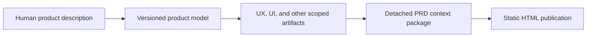
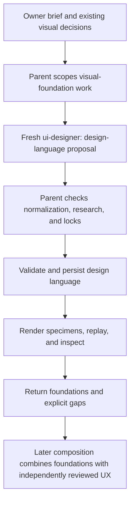
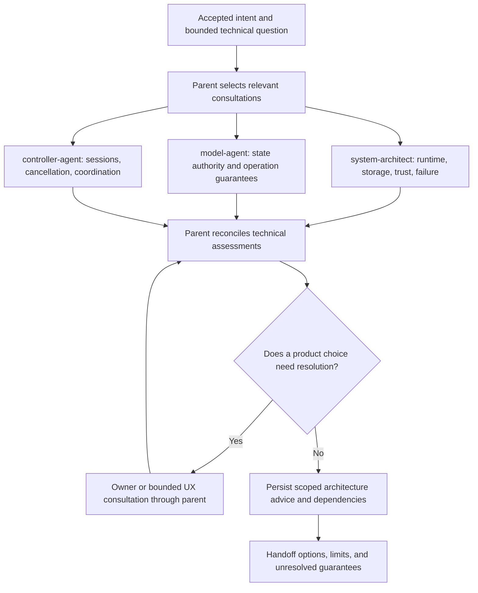
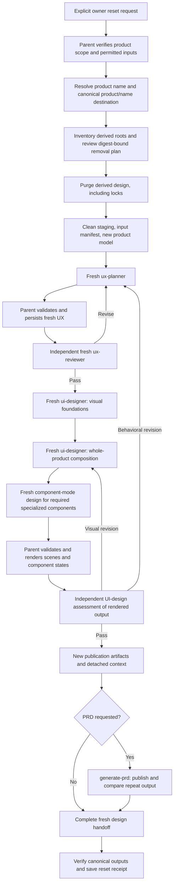

# Working with product-design skills

The product-design workflow turns human intent into durable requirements, interaction designs, visual specifications, and a published review document. You can start with a rough idea, refine one decision, or develop a complete design over several calls.

Three skills own different parts of that work:

| Skill | Use it when | Main result |
| --- | --- | --- |
| [refine-design](refine-design.md) | You want to develop or revise product, UX, UI, or bounded architecture decisions. | Current product and design artifacts, with a context package ready for publication when requested. |
| [generate-prd](generate-prd.md) | The context is ready and you want a human-readable product requirements document. | A deterministic static HTML publication and an integrity receipt. |
| [reset-design](reset-design.md) | You explicitly want to discard the complete derived design and rebuild from the current human description. | A fresh product/design history, reset evidence, and optionally a new PRD. |

These skills plan and document a product. They do not implement its application code. Project scaffolding belongs to `initialize-project` and `create-app`; code compliance belongs to the separate [review-agent workflow](review-agents.md).

## Who participates

The **parent** in the flows below is the main assistant running the skill. It scopes the work, gives specialists their inputs, reconciles their findings, checks research, and operates validation, persistence, and rendering tools. It also asks you to resolve consequential choices that cannot responsibly be settled from the available evidence.

Specialists receive bounded assignments and return assessments or structured proposals. They do not write the product files, render the final artifacts, implement code, or independently commission other agents. Cross-specialty questions return through the parent.

| Agent or participant | Responsibility | Typical contribution |
| --- | --- | --- |
| Product owner | Intent, requirements, constraints, and explicit lock/reset authority | A description, correction, reference, unresolved choice, or instruction to protect a decision. |
| Parent assistant | Scope, semantic interpretation, specialist coordination, synthesis, and artifact operations | A current product model, validated design records, checked research, and an honest handoff. |
| `ux-planner` | Tasks, journeys, surfaces, actions, interaction states, feedback, cancellation, recovery, and removing unnecessary steps | A structured UX proposal and semantic wireframes describing what users can do and what happens. |
| `ux-reviewer` | Independent product-design review of the saved UX and requested scope | A `pass` or `revise` receipt covering coherence, action economy, recovery, accessibility baseline, research, and UI handoff. |
| `ui-designer` | Visual foundations, presentation, hierarchy, layout, component states, and visual accessibility | Structured design-language, whole-product composition, or specialized-component proposals. |
| `system-architect` | Runtime and host boundaries, storage, APIs, trust, resources, and failure tradeoffs | Technical feasibility, architectural options, and missing guarantees relevant to the requested decision. |
| `model-agent` | Domain meaning, authoritative state, invariants, operations, and persistence/transport contracts | Read-only assessment of the guarantees the product or architecture needs. |
| `controller-agent` | Workflow coordination, sessions, races, cancellation/retry, resource ownership, and view-facing contracts | Read-only assessment of how operations and lifecycle transitions should be coordinated. |
| Independent UI-design assessment agent during reset | Qualitative review of fresh rendered surfaces and component states | A `pass` or `revise` assessment against the UI-design review contract, separate from the producing designer. |

The last row describes a fresh assessment assignment, not an additional installed role named `ui-designer-reviewer`. It uses the [UI-design assessment contract](../planning/implementation-agents/ui-designer-review.md). It is also distinct from `ui-reviewer`, the engineering standards reviewer.

`view-agent` and `polylith-architect` exist in the wider toolkit, but they are not automatic participants in refinement. Their availability alone does not authorize a coding workflow. Refinement uses additional technical specialties only when their actual contracts support the requested planning path.

## What carries decisions between calls

Conversation history is not the durable design record. Repository-backed work persists its product-design data under `product/<name>/` at the repository root, regardless of where the source description is located.

### Establish the product name

`refine-design` reads the complete human description for a clear product name.
If it is missing or ambiguous, the skill asks you for it before saving any
product-design data. An explicit name already supplied in your current request
answers that question. It does not infer the name from the repository, topic,
source filename, or an example product.

The folder preserves a safe name's spaces and case: `Field Journal` becomes
`product/Field Journal/`. Unsafe names require an explicitly chosen portable
folder name, recorded alongside the display name. An existing human description
stays where it is; a new one normally lives in the named product folder.

```text
repository/
  documentation/product-description.md    # Existing human input can stay here
  product/
    Field Journal/
      current.json
      sources/
      models/
      snapshots/
      artifacts/
      artifact-resources/
      contexts/prd/<digest>/context.json
      ux/ux-spec.json
      design-language/design-language.json
      ui/ui-spec.json
      ui/components/
      prd/                               # Default generated review site
```

The data root is also used for scoped planning, research, and review receipts.
A changed product name or pre-existing store elsewhere needs an explicit
identity/relocation decision rather than an automatic second store or reset.
Detached context packages and explicitly requested PRD exports remain portable.



The description remains readable Markdown. The parent interprets it into a structured model with stable record identities, exact source snapshots, and explicit changes. Specialty artifacts reference the product decisions and other artifacts they depend on. Deterministic writers validate and store those decisions; they do not infer the meaning of prose.

This supports incremental work. A change to cancellation behavior can invalidate affected UX, UI, and controller advice without reopening unrelated typography. A wording-only change may require rebinding evidence without changing the material design. Prior artifacts remain auditable, while stale or locked-conflict payloads are excluded from downstream context.

| Decision state | What it means for you |
| --- | --- |
| Accepted working decision | A concrete choice has been incorporated. Ordinary refinement can revisit it; a separate approval click is not required for every selected specialist recommendation. |
| Unselected alternative or unresolved gap | No usable choice has been adopted. The workflow records the uncertainty instead of pretending the design is complete. |
| Locked decision | You explicitly protected a named scope. Ordinary refinement cannot change its content or dependency bindings without current authority for that scope. |
| Stale or locked-conflict artifact | An upstream change affects the artifact. It must be reassessed, or the lock conflict resolved, before dependent work can rely on it. |

A human edit to the description takes precedence over conflicting derived working choices. A lock conflict is reported and preserved rather than silently resolved. Only an explicit whole-design reset authorizes discarding the targeted accepted and locked derived history together.

## Refine a product: UX through UI

Use a request that identifies the product and the outcome you want:

```text
Use $refine-design product: develop documentation/product-description.md into
the main user workflows, reviewed UX, and representative UI compositions.
```

The following is the interaction flow for a scope that includes UX and UI. A narrower call may stop after a product decision or UX revision. Refinement does not run every specialist simply because it is installed.

```mermaid
sequenceDiagram
    actor Owner
    participant Parent as Parent: refine-design
    participant Store as Validators and artifact store
    participant UX as Fresh ux-planner
    participant Review as Fresh ux-reviewer
    participant UI as Fresh ui-designer
    Owner->>Parent: Product description, requested scope, constraints
    opt Product name is unclear and not already supplied
        Parent->>Owner: What is the name of this product?
        Owner-->>Parent: Confirmed product name
    end
    Parent->>Parent: Resolve repository-root product/name directory
    Parent->>Store: Persist current semantic product model
    Parent->>UX: Bounded UX question and current authority
    UX-->>Parent: UX proposal, selected patterns, research, gaps
    Parent->>Parent: Reconcile intent and verify material sources
    Parent->>Store: Validate, persist, and replay exact UX
    Parent->>Review: Saved UX, exact description, scope, checked evidence
    Review-->>Parent: pass or revise
    alt revise or unavailable independent review
        Parent-->>Owner: Blocking findings or unavailable gate
        Note over Parent,Review: Revise UX, persist, and use a fresh review; dependent UI stays gated
    else validated pass
        Parent->>UI: Reviewed UX and current visual foundations
        UI-->>Parent: Composition proposal and any UX change requests
        Parent->>Store: Validate, persist, render, and inspect
        opt Specialized components required
            Parent->>UI: Fresh bounded component assignment
            UI-->>Parent: Component scenes, states, research, limits
            Parent->>Store: Validate and render component and owning surface
        end
        Parent->>Store: Package current artifacts and PRD context when requested
        Parent-->>Owner: Saved decisions, review output, gaps, next useful step
    end
```

The UX planner owns the interaction: task order, available actions, state transitions, feedback, cancellation, and recovery. It may research an unfamiliar pattern before selecting an adaptation. The parent checks material sources and reconciles the result with your intent before persistence. If selected behavior changes the human description, the product model and downstream bindings must be brought current as well.

The independent UX reviewer assesses the exact persisted candidate. A `revise` verdict returns findings to UX synthesis; correction requires new validation and a fresh review. A `pass` is bound to the description, UX bytes, and reviewed scope. Changing any of those makes the receipt stale. It is a readiness gate for dependent UI work, not proof of usability, accessibility conformance, or implementation correctness.

The UI designer works within that accepted interaction contract. It chooses geometry, hierarchy, typography, colors, and visual states. A proposed behavior change goes back through the parent to UX; a composition cannot silently add actions or redefine cancellation. Behavioral nodes are bound to the reviewed UX actions, and scenes reference exact interaction frames.

Specialized components use the UI designer's component mode. For unfamiliar or product-specific interfaces, it supplies research, alternatives, states, and an explicit account of what the rendering can represent. The parent checks sources and renders both the component and its owning surface. A labeled placeholder remains a partial wireframe; it is not promoted to a finished comp merely because HTML was generated.

### Refining visual foundations alone

You can establish a design language from a sparse brief without commissioning a complete application map:

```text
Use $refine-design to establish visual foundations from this brief, keeping
unresolved branding choices explicit and avoiding invented product screens.
```



Foundations cover application-wide color, typography, spacing, ordinary controls, and reusable patterns. They do not invent product behavior to fill out a component catalog. Product-specific surfaces and controls belong in compositions or component designs. Composition and component work dependent on UX still require the independent UX pass described above.

### Refining an architecture question

Architecture planning is a second scope within the same skill:

```text
Use $refine-design architecture: assess what guarantees are needed for an
export to continue after the user leaves the screen. Preserve accepted UX.
```



The branches are possible consultations, not three mandatory calls. Independent questions may run concurrently; a question that depends on another role's answer must wait. A technical assessment cannot silently decide whether users should be allowed to leave the screen or what cancellation promises them. Those choices belong to product/UX authority.

The default is one focused consultation round, usually one or two roles, with at most one targeted follow-up round unless your request calls for broader work. Zero consultations is appropriate for recording an explicit decision or reusing a still-current assessment. Specialists are fresh for each bounded assignment; durable records supply future context.

### Availability and completion

When a named planner is unavailable, ordinary refinement can continue with honestly labeled `parent-assessment` work. The parent cannot substitute its own reread for an independent UX review: useful product and UX work may continue, while dependent UI remains gated.

The result should tell you what changed, where it was saved, what remains unresolved, and which evidence or capabilities were unavailable. A discussion-only request can return advice without creating files. A saved design is planning output, not an automatic implementation authorization.

## Publish a PRD: no new design decisions

Once refinement has prepared the context package:

```text
Use $generate-prd to publish <context.json> into <output-directory>.
```

```mermaid
sequenceDiagram
    actor Owner
    participant Parent as Parent: generate-prd
    participant Context as Detached context and resources
    participant Publisher as Deterministic publisher
    participant Output as Static site and receipt
    Owner->>Parent: Context path and output destination
    Parent->>Context: Locate complete package
    Parent->>Publisher: Publish context to destination
    Publisher->>Context: Validate bindings, dependencies, locks, digests, resources
    alt Invalid input or output ownership conflict
        Publisher-->>Parent: Validation error
        Parent-->>Owner: Explain failure; input corrections return to refinement
    else Valid input and destination
        Publisher->>Output: Write manifest-selected site or compact review
        Publisher->>Output: Write publication-receipt.json
        Publisher-->>Parent: Publication result
        Parent-->>Owner: Output location and publication evidence
    end
```

No specialist agent is involved in this skill. It does not read the original Markdown, consult UX or UI, conduct research, or fill gaps. The publisher consumes validated persisted decisions. A publication request cannot resolve a design disagreement.

Without a structured publication manifest, output is a compact product-model review. A manifest selects a full site with supported UX, design-language, component, and composition content and declared resources. Partial artifacts expose gaps; stale and locked-conflict payloads remain excluded.

The context is self-contained. If moving it, copy its complete package directory, including `artifact-resources/` when present. Identical context bytes produce identical publication output. The receipt inventories generated files and consumed resources; it records integrity, not authenticated authorship.

Refinement may render bounded specimens and comps for inspection. The final PRD publication handoff belongs to `generate-prd`. Update structured source decisions and republish instead of editing generated HTML.

## Reset a design: a fresh sequence with independent gates

A reset is an explicit decision to discard the target product's complete derived design, including accepted and locked derived artifacts:

```text
Use $reset-design to rebuild the complete design for <product-topic> from its
current product-description.md. Preserve the explicitly named owner resources
and include a new PRD.
```

Ordinary dissatisfaction with one component or a request to regenerate the PRD is not reset authority. Use refinement for those cases.



Every design and review assignment receives only permitted starting inputs and fresh upstream artifacts from this run. A repeated stage uses fresh consultation context; it does not revive an old agent thread. Visual findings return to the relevant composition or component designer. Behavioral findings return through UX and require the affected downstream stages to run again.

The reset sequence has an additional explicit qualitative UI gate. A new independent UI-design assessment inspects clean and annotated renders with the exact fresh UX and visual foundations. It checks whether controls, hierarchy, density, labels, states, focus, and other details are credible implementation guidance. Structural schema validation alone does not satisfy that gate. Unresolved placeholders stay wireframes.

The parent records source and artifact hashes, actual agent identities, new research, review outcomes, render evidence, and final output locations. Completion includes required reviews, relevant browser inspection, and byte-stable repeat-publication evidence when publication is requested. Unavailable required specialists or independent reviewers leave the reset incomplete.

**The purge is irreversible and occurs before fresh design work.** There is no rollback copy of prior derived authority. If rebuilding fails, the old design remains absent and fresh failure evidence is retained. The current human description and eligible owner resources survive; application code, unrelated documentation, and external systems are outside the reset.

Fresh validated data returns to `product/<name>/`. If the human description or
preserved resources live inside that directory, the reset removes only verified
derived children, not the containing product folder. Other products under the
repository's `product/` directory are outside the reset scope.

The isolation claim is limited: the workflow controls supplied inputs and records their provenance, but the shared agent workspace does not provide an audited per-agent filesystem sandbox. Text already in the human description also remains input even if it originated in an earlier design discussion.

## Choose the next useful action

| Situation | Next action |
| --- | --- |
| You have rough notes or a new product idea | Start a bounded `refine-design product` request. |
| A workflow feels cumbersome | Refine that UX scope, then obtain a fresh independent UX review before updating dependent UI. |
| Colors, type, or ordinary control treatment need direction | Refine the design language; preserve product behavior. |
| A specialized control is still a labeled placeholder | Request component-mode design through refinement, including research and representative states. |
| A technical guarantee affects a product promise | Use a bounded architecture consultation and return product implications to their owner. |
| The saved design is ready to share as HTML | Resolve the current PRD context and invoke `generate-prd`. |
| An input change reaches a locked design | Identify the conflict and explicitly decide whether that named lock should change. |
| You want all derived choices reconsidered without old-design influence | Explicitly request `reset-design` for the complete named product scope. |

The design gates and engineering review gates serve different purposes. A UX pass or credible comp does not certify implementation compliance, and a standards-clean code review does not establish that the product design is useful. Use both at the stage where they can evaluate actual evidence.

[Refinement skill](refine-design.md) · [PRD publication](generate-prd.md) · [Design reset](reset-design.md) · [Engineering review agents](review-agents.md) · [All skills](../README.md)
