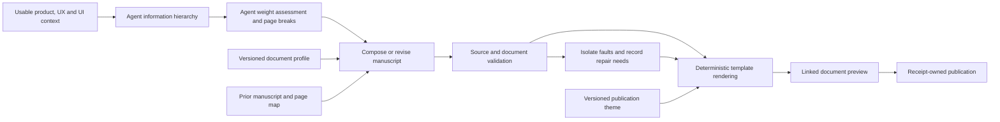

# Product documents: proposed design

Revision 6, 2026-09-26. Proposed publication format, not an implemented generator
contract. The owner has reaffirmed the PRD and detailed interaction document;
the separate design-language document and the exact layouts below are proposed.
Decimal section numbering for the interaction guide is owner-accepted.
Resilient continuation with visible repair needs is also owner-required; its
proposed contract is recorded in [resilience](resilience.md).

Open the [linked HTML sample](design-preview/prd.html) to review the appearance.
It contains a synthetic PRD, interaction guide, and design-language reference.
Its sample product decisions and comps demonstrate the format; they are not
Alexa artifacts or accepted application design. The research is recorded
[separately](research.md).
The detailed sample includes a six-step use case owned by the Harvest entry
form, including its confirmation dialog, editing/review states, validation,
cancellation, and retry paths.
The review stage illustrates the pattern; it is not a required product behavior.

## 1. The document set

| Document                                      | Reader's purpose                                                                                  | Primary content                                                                                                                     | Proposed path                          |
| --------------------------------------------- | ------------------------------------------------------------------------------------------------- | ----------------------------------------------------------------------------------------------------------------------------------- | -------------------------------------- |
| Product requirements                          | Understand why the product exists, what it must do, its boundaries, and how success is judged     | Purpose, users, outcomes, scope, concepts, requirements, rules, quality constraints, acceptance, dependencies, unresolved decisions | `documents/<product>/prd/`             |
| Interaction guide                             | Understand how someone completes each goal and what the interface does along every specified path | Application orientation, use cases, detailed steps, state changes, alternatives, dialogs, cancellation, recovery, inline comps      | `documents/<product>/interactions/`    |
| Design language — proposed separate reference | Apply the same visual rules and ordinary components throughout the product                        | Visual direction, typography, color, layout, surfaces, icons, component specimens, shared states, decisions and gaps                | `documents/<product>/design-language/` |

The existing technical guide stays separately owned by `generate-technical`.
It may appear in collection navigation when a verified guide exists. It is not
one of these product-document outputs.

The first two documents are required even for a sparse product. Sparse material
produces short sections and visible gaps, not a different document identity.
Recommend the third document when adopting this format; choose its inclusion
once in the product's publication profile. Agents cannot independently add,
remove, combine, or rename these documents on later runs. If the separate
reference is not selected, shared visual material has one supporting location
inside the interaction guide. It must not disappear or migrate on each run.

All documents introduce the context needed by their own audience. Cross-links
provide deeper detail and authority without forcing a reader to assemble a
basic explanation from several documents.

## 2. PRD structure

Use this fixed top-level order. Product-specific headings belong inside these
sections. The document is written in connected prose with requirements and
comparison tables where they improve reading.

| Order | Section                     | What readers should learn                                                                                                     |
| ----- | --------------------------- | ----------------------------------------------------------------------------------------------------------------------------- |
| 1     | Product overview            | Problem, intended benefit, current scope and maturity; concise orientation before any catalog                                 |
| 2     | Users, goals, and success   | Primary user roles, their goals, intended outcomes, and supported measures of success                                         |
| 3     | Scope and boundaries        | Included capabilities, explicit exclusions, assumptions, and external boundaries                                              |
| 4     | Product concepts            | The vocabulary and domain concepts needed to interpret requirements                                                           |
| 5     | Functional requirements     | Required behavior grouped by stable product area, including applicable rules and local acceptance criteria                    |
| 6     | Quality and constraints     | Accepted accessibility, reliability, performance, privacy, platform, or other constraints relevant to this product            |
| 7     | Acceptance and dependencies | Cross-area acceptance scenarios, dependency effects, and links to detailed criteria; no copied checklist of every requirement |
| 8     | Open decisions              | Unresolved questions with the affected scope and actual decision status                                                       |

Document metadata includes the product, document title, revision, and actual
source status. Show an owner, release, date, priority, or metric only when that
information exists. A publication revision does not imply product approval.

### Requirement pattern

Each product area starts with a short explanation of what it enables and how
its requirements fit together. Then use repeated, quietly separated requirement
sections rather than a wall of cards or a spreadsheet of long paragraphs:

1. Stable display ID and meaningful title.
2. Complete requirement statement describing observable required behavior.
3. Rationale or applicable business rule, when supported.
4. Acceptance criteria expressed as observable outcomes, preserving source
   qualifications and alternatives.
5. Links to the relevant use case and detailed interaction.
6. A secondary source disclosure with exact provenance and decision status.

Do not number requirements from their current array order. Keep published IDs
stable when headings move. A renamed requirement retains its identity.

For example, a source-backed requirement about rejecting an empty entry becomes
an explicit requirement and criterion. The wording of the error, its placement,
focus behavior, and the resulting screen are detailed in the interaction guide
when specified by UX/UI. A PRD may contain a useful overview image, but does not
repeat every comp or click sequence.

### Missing information

Keep the eight section anchors stable. An unsupported section contains a short
statement such as "No performance target has been specified" and, when present,
a link to the relevant unresolved question. Unknown is different from explicitly
out of scope or not applicable. Do not insert invented targets to complete the
format. Optional subsections appear only when there is actual material.

## 3. Interaction guide: agent-owned hierarchy and page breaks

Keep the `document-structure` agent's established process for documenting
application structure, flows, and use cases: inventory the supplied information,
create a meaningful hierarchy, assess its weight, then choose page breaks.
This is an explicit owner requirement. The hierarchy is not replaced by a fixed
chapter list, one page per source type, or a renderer-selected pagination rule.

The agent organizes related application areas, their layouts and navigation,
user goals, flows, detailed use cases, dialogs, and shared interactions. It
chooses where orientation is needed, where a subject stays inline, and where
depth warrants another page. An area can introduce its layout and then contain
its flows and use cases. Shared behavior can have a common home with contextual
links from its uses. Cross-area journeys retain a coherent account as flows
linking local use cases.

### Use cases belong to identified interaction objects — current owner direction

For now, every use case belongs to one specifically identified user interaction
object: for example, a named form, dialog, panel, menu, or interactive surface.
It explains using that object in particular ways. Give the object a stable ID,
name, responsibility, entry/exit boundaries, and its supported local use cases.
Identify the owning object at the start of each use case.

A local use case can have several steps, states, alternatives, and recovery
paths. It may include subsequent dialogs, pickers, or similar supporting
interactions opened while using its owning object. Those interactions stay
inside the same use case when they serve its goal; they do not automatically
require separate cases. Describe their trigger, actions, result, and return
or exit, preserving which object owns the case and which surfaces participate.

A multi-step form can also include editing and review states. Local scope does
not mean one screen or one surface. Document a broader journey connecting
independent tasks as a flow linking their local cases. Entry/exit context may
show the surrounding application without expanding the local responsibility.

The structure agent organizes these objects and their cases, then chooses page
breaks. Object ownership is a semantic reference independent of outline position
or display numbering. Reorganization must not infer or change ownership. An
unknown or conflicting owner is a repair need: retain usable material with an
explicit ownership gap instead of inventing an object or halting publication.
This is the working scope for now and can be revisited explicitly later.

The format supplies reusable page patterns, not a replacement information
hierarchy:

| Page pattern          | What it presents                                                                                              |
| --------------------- | ------------------------------------------------------------------------------------------------------------- |
| Application overview  | Product orientation, major areas, shared shell/navigation, and a full-context comp when supplied              |
| Area overview         | The area's purpose, layout, available activities, its place in the application, and the next subjects to read |
| Interaction object    | Identified object, responsibility, states, entry/exit boundaries, and its local use cases                     |
| Local use-case detail | A way of using one identified object, with steps, visuals, alternatives, and outcomes                         |
| Flow overview         | A broader journey linking local use cases and explaining handoffs between their objects                       |
| Shared interaction    | Reused complex behavior, its meaningful states, and references to each invoking flow                          |

The agent can place several patterns on a page or let a substantial pattern
occupy a page. Reusable patterns do not automatically create page breaks.
Missing behavior, missing visuals, and unresolved choices appear where they
affect the reading, with an optional consolidated coverage view.

The saved hierarchy and page-break plan govern later composition and rendering.
The composing pass cannot flatten that hierarchy or move content to different
pages. When source growth or feedback warrants a change, the same structure
agent revises the existing hierarchy and plan and provides a navigation diff.
Ordinary rendering reuses them without asking another agent to organize anew.
When a saved node, edge, or page is unusable, the recovery rules permit an
explicit provisional placement at a usable ancestor or recovery section.
This overlay preserves the saved plan and records the deviation for repair;
it does not silently replace the structure agent's organization.

### Decimal section numbering — accepted

Owner decision, 2026-09-26: use decimal outline numbers for the interaction
guide's sections. Generate them from the structure agent's saved, ordered
information hierarchy, independently of its HTML page breaks. For example:

```text
1         Harvests
1.1       Harvest entry form
1.1.1     Record a harvest
1.1.1.1   Main sequence
1.1.1.2   Alternatives and recovery
1.1.1.3   End states
1.1.1.4   Shared references and gaps
```

This is an illustration of numbering, not a prescribed product hierarchy.
Show the same section numbers in headings, contents/navigation, and section
cross-references. Continue numbering across the guide's HTML pages; a page
break neither restarts the sequence nor adds a level. Derive the numbers from
one section map so rendering and later agents cannot assign competing values.

Owner refinement: numbering has no gaps. Each document's top-level sequence
starts at `1`, and each parent's children start at `.1` and proceed consecutively
through `.2`, `.3`, and so on. Derive these labels from the current published
hierarchy, not from source IDs or numbers retained from an older organization.
Removing or excluding a section closes the gap; do not jump from `1.3` to `1.6`.
A later HTML page continues its section's assigned number rather than restarting
the document. The no-gaps rule applies across that complete document hierarchy.

Keep action-step numbers local to each flow, separate from section numbers.
Stable requirement/use-case identities such as `UC-01`, internal section IDs,
and link targets remain independent of decimal display numbers. Cross-references
bind those stable IDs and resolve the current section label during rendering.
Re-pagination alone does not change numbering. An accepted hierarchy revision
may renumber sections; update their displayed references together and include
the numbering changes in the navigation diff without changing their identities.

### Internal references are independent of the outline — accepted

Owner clarification, 2026-09-26: external outline numbers can change during
design refinement and PRD generation. Internal data references do not follow
the information hierarchy. Identify a requirement, use case, interaction,
state, or visual independently of its current document, parent section, depth,
position, or page. Reorganizing its presentation does not change that identity
or the references other records hold to it.

For example, the same `UC-01` can appear under section `2.1` in one publication
revision and `4.3` in the next. Its governing requirements and linked states
still reference `UC-01`. Do not encode `2.1`, an ancestor chain, or a page path
into its identifier. Store editorial parent/child relationships, reading order,
page placement, and display numbers separately from semantic data relationships.

The publication maintains a placement map from stable identities to their
current section, page, anchor, and display number. Rendering uses that map to
resolve cross-reference labels and destinations. A moved item may acquire a
different page URL while remaining the same logical link target. Preserve useful
page paths where possible, but data identity does not depend on URL stability.

Stable identity does not imply unchanged content: exact revision/digest bindings
still establish which source version a manuscript describes. A source revision
requires the existing impact and freshness checks. Publication reorganization
alone must not rewrite canonical source IDs or semantic relationships.

### Use-case chapter pattern

| Order | Part                       | Required treatment                                                                                                                                                                         |
| ----- | -------------------------- | ------------------------------------------------------------------------------------------------------------------------------------------------------------------------------------------ |
| 1     | Goal and context           | Human-readable title, stable use-case ID, owning interaction object's ID/name, actor, starting conditions, trigger, entry/exit boundaries, successful outcome, governing requirement links |
| 2     | Flow overview              | Brief reading map of the specified path and important branches; complex flows may include a diagram                                                                                        |
| 3     | Main sequence              | Numbered user actions and system responses with resulting state, feedback, and the appropriate inline comp                                                                                 |
| 4     | Alternatives and recovery  | Named divergence points, conditions, actions, system response, and rejoin or exit; cancellation and failure included when specified                                                        |
| 5     | End states                 | What has changed, what persists, where the person ends up, and what happens after abandonment or failure                                                                                   |
| 6     | Shared references and gaps | Contextual links to reused interactions and design rules; precise missing behavior or visuals                                                                                              |

In the main sequence, show the actor's action and the system's response together.
Put a branch marker beside the step where it diverges and link to that branch's
explanation. Do not force the reader to infer flow order from source IDs or
page links. Keyboard, focus, announcements, timing, and responsive differences
belong beside the affected step when specified; a missing detail is a gap.

### Comps

Start with the full screen when it is needed for orientation. Place each later
comp or focused crop beside the step, dialog, or branch it explains. Captions
name the state, triggering action, and relevant callouts. Images keep their
aspect ratio; labels stay readable through a full-size view. A diagram can
summarize the sequence but does not replace a readable full comp.

The figure carries its actual state: accepted comp, proposed comp, partial
wireframe, or missing visual. Source acceptance, visual fidelity, and scope of
coverage are separate properties. A polished example of one state does not
establish full coverage. Current scenes must all have an accounted location,
including a clearly labeled supplemental visual section for scenes that do not
fit a known flow; lack of a semantic link remains a reported gap.

Simple visual rules link to Design language. A specialized multi-step picker or
editor with significant product behavior belongs in Shared interactions and is
explained at its point of use. A use case must remain understandable without
reading an unrelated component catalog.

## 4. Design language as a separate document

Recommend this supporting document because it gives shared rules one durable
home while keeping the first two documents focused. It publishes the existing
`refine-design` design-language source; it does not ask a publication agent to
design a new theme. Current source schema and renderer limits still apply.

Preserve the established content organization:

1. Visual direction.
2. Typography, with representative text.
3. Colors and theme, with role names and swatches.
4. Spacing and layout, with scales and application guidance.
5. Shape and surfaces.
6. Iconography.
7. Basic component examples, selected for the decisions they demonstrate.
8. Shared states, including focus, selected, disabled, feedback, and errors as
   supported by the source.
9. Decisions and gaps, followed by open questions.

A compact component specimen explains intended use, anatomy, specified sizes or
roles, variants, and supported states. Display accepted, proposed, and defaulted
values accurately. Do not turn example widths into application-wide rules.
Detailed product copy, workflow decisions, and product-specific layouts stay in
the interaction guide. The same shared visual source supplies specimens and
product comps, avoiding separately maintained values.

The document's own typography and navigation use the publication theme. Product
tokens are isolated inside specimens and comps. Changing a product's design
language must not restyle or break the document reader.

Reuse the existing component templates for ordinary controls, including the
MUI outlined-field label treatment. Resolve focus and other state colors from
the current product's supplied theme roles. A specimen must not introduce an
independently chosen focus color or carry over another product's branding.
The hand-authored HTML samples have known component-fidelity limits, recorded
in their README; those limits are not proposed changes to the shared templates.

## 5. Visual design of the publications

The HTML samples demonstrate a restrained document reader:

- Persistent collection navigation across PRD, Interactions, and the proposed
  Design language reference; clear current-document state.
- A narrow contents column, readable main column, and generous vertical rhythm.
  The contents column shows editorial subjects rather than source kinds.
- A clear title, short introduction, compact revision line, and predictable
  heading hierarchy. Status is textual and never conveyed only by color.
- Quiet separators for requirements, numbered flow steps, tables for comparisons,
  and large figure areas. Use callouts for a decision or gap, not every paragraph.
- Exact source IDs, digests, schemas, and renderer diagnostics stay in support
  artifacts or secondary provenance disclosures. Friendly requirement/use-case
  IDs remain visible because readers use them to discuss the product.

Proposed desktop baseline: 260px contents column for numbered navigation, 40–56px main padding, a main
content maximum near 1000px, and prose near 70 characters per line. Use a 16px
body with about 1.6 line height, a 40–48px document title, and distinct 28px/20px
section levels. These are publication-theme choices, not product-design tokens.

On narrow viewports, place navigation above the content, wrap the collection
links, stack flow text and visuals, and contain any wide table or comp locally.
Use semantic landmarks, a skip link, visible keyboard focus, descriptive links,
real heading order, figure captions, and image descriptions. Print hides sticky
navigation and preserves headings, criteria, and captions; it must not crop
figures or hide essential content in closed disclosures.

## 6. Stable format with controlled variation

| Persisted item                        | Stable across ordinary runs                                                                       | How it changes                                                                                        |
| ------------------------------------- | ------------------------------------------------------------------------------------------------- | ----------------------------------------------------------------------------------------------------- |
| Publication profile                   | Required document roles, selected optional reference, PRD section order, allowed content patterns | An explicit format revision                                                                           |
| Interaction section numbering         | Decimal labels derived from the saved logical hierarchy, continuous across pages                  | Recompute after an accepted hierarchy revision; preserve stable section/use-case IDs and link targets |
| Publication theme                     | Document typography, spacing, navigation, tables, figures and callouts                            | A theme revision with visual comparison                                                               |
| Agent's hierarchy and page-break plan | Product-area identities, parent/child subjects, page paths, reading order, anchors                | The structure agent's saved revision with old/new navigation diff                                     |
| Reader manuscript                     | Reviewed prose, criteria presentation, flow explanations, captions and source links               | A bounded content patch tied to a request or source change                                            |
| Canonical product/UX/UI sources       | Product facts, behavior, decisions, scene meaning                                                 | The existing refinement workflow                                                                      |
| Repair ledger and recovery placement  | Affected stable IDs/revisions, gaps, fallback locations, user repair steps                        | A recorded failure or a validated repair; retain the accepted hierarchy separately                    |

Freeze structure, not the entire product vocabulary. Different products have
different areas and use cases. The structure agent creates their hierarchy and
page breaks before composition, using its existing inventory and weight process.
Once saved, these are inputs to later runs, not choices to rediscover. New source
facts extend the existing structure through an explicit revision. They cannot
be silently dropped to preserve an old layout.

## 7. Composition is a separate persisted stage

The proposed pipeline is:



The saved plan assigns subjects to pages. The manuscript composes those subjects
into reader-facing content on the assigned pages; it does not make a competing
outline. It uses named blocks such as overview prose, requirement, acceptance
criteria, use-case context, flow step, branch, figure, specimen, and gap. Each
factual block carries exact source references; figures also bind the scene,
state, visual resource, and its actual fidelity. Save the composed prose, not
just the instructions that might reproduce it.

An agent can write connective explanations, group related material, and clarify
the reading path without inventing decisions. Direct requirement clauses and
criteria retain their canonical meaning, conditions, and status. A validator
can prove reference and coverage integrity; it cannot prove that arbitrary
paraphrases preserve meaning. Editorial review must check that separately.

Source coverage need not mean one visible block per source. Several records may
support one coherent paragraph or flow step; one rule may support several
contextual explanations. A coverage ledger records the canonical published
home, contextual uses, or an explicit exclusion for every eligible source.
Unavailable material is accounted for as needing repair, with its usable parts,
fallback location, and issue reference; it is not counted as complete coverage.
Generated summaries and repeated labels are derived from one authority. The
published text is a reader view, never a second place to change product facts.

## 8. Revision and repeatability

1. **Render again:** use the exact saved sources, manuscript, page map, profile,
   templates, theme, and assets. No agent invocation; output bytes repeat.
2. **Tweak presentation:** change the profile or theme version and preview the
   same manuscript. Compare appearance and navigation; preserve content.
3. **Tweak writing:** give the composing agent the saved baseline and a bounded
   edit request. Persist a patch and show the content diff. Unaffected blocks
   remain unchanged. **Tweak organization:** return to the structure agent for
   a hierarchy/page-break revision, then recompose only the affected subjects.
4. **Update product sources:** identify affected blocks through their references
   and relationships. Add newly eligible material, revise impacted text, and
   remove retired facts deliberately. Revalidate all exact bindings; never
   carry an old manuscript forward by changing digest fields alone.
5. **Start a fresh session or use another agent:** load the same persisted
   baseline and edit scope. The new agent has no authority to restart the
   publication design because it would choose differently.

A first-time composition remains a judgment task. Independent agents may choose
different wording before a baseline exists. The proposed system guarantees
the same document roles and patterns, then preserves the selected manuscript
across subsequent runs. It does not promise identical fresh prose from a model.

Ordinary regeneration does not require a new approval conversation. A request
to revise a particular aspect authorizes that bounded revision. The reviewable
diff exposes any proposed structural change outside that scope before it is
adopted. The prototype and initial format are available for revision now;
implementation follows the [plan](plan.md).

## 9. Continue through failures — accepted requirement

A failed record, relation, agent assignment, comp, or rendering operation must
not abort independent work. Mark affected data as needing repair and continue
with trustworthy material. Traverse usable children and siblings; when neither
offers a path, climb to an ancestor with unvisited work and continue from there.
Track visited nodes and bound retries so failures and cycles cannot trap a run.

Show local gaps and actionable repair instructions in the documents, with a
linked repair summary. Missing UI material does not block available requirements
and interaction text. If only a scaffold/report can be produced, say so. Do not
invent facts, disguise stale sources, or claim successful delivery after a write
failure. Preserve existing output when replacement is unsafe and complete an
authorized preview/report instead.

Derive gap-free numbering and links from the effective displayed hierarchy,
while keeping internal identities and the accepted plan intact. Persist repair
state and fallback placements so later agents can continue and repaired inputs
can restore the intended organization without rewriting unrelated material.
The [resilience contract](resilience.md) details traversal, fallback behavior,
reader notices, the repair cycle, and required validation evidence.
