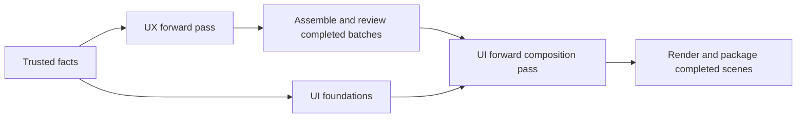

# Single-pass UX and UI production

Recorded 2026-09-26. This is the concrete working method requested after the
[UX/documentation synthesis](ux-documentation-synthesis.md). It starts at the
existing facts-to-UX handoff, which the owner says to assume is satisfactory.
Parsing, fact extraction, and rebuilding that handoff are outside this work.
The executable route is now documented in the
[single-pass authoring contract](../../skills/refine-design/references/single-pass-design.md).
The [execution plan](single-pass-execution-plan.md) and its metrics track delivery.
The implementation uses atomic per-record JSON files in place of the initial JSONL
suggestion below, and projects into the existing expanded consumer schemas.
Foundation overlap is supported; reviewed per-batch composition remains deferred.

## 1. Operating rule

UX makes one forward authoring pass through the supplied facts. UI makes one
forward authoring pass through the resulting eligible UX. Each writes usable
records as work proceeds. Each may have one optional, bounded reconciliation
pass over identified issues. Code assembles and checks the records. Where useful,
pipeline these stages: UI foundations can accompany UX, and UI can compose a
released UX batch while UX continues with later work (section 7).

Here, **single pass** means each input unit receives one primary design
treatment. It permits retained working context, indexed reference lookups, and
incremental additions to an element when later facts describe it. It excludes
routine successive assignments to inventory the whole product, redesign its
flows, expand them into a second behavioral model, and finally serialize it all
again. It does not mean a single model response or that all reasoning and tool
calls have constant cost.

The optional post-process visits each queued issue once and changes only its
affected records. It does not generate another whole-product proposal. Assembly
uses a bounded number of scans and direct ID lookups: work proportional to input
bytes, references, patches, and actual rendered output. No repeated whole-file
search for each reference, all-pairs comparison, recursive include expansion,
or enumeration of every combination of UI conditions.

Independent review remains a quality check. It is not another authoring pass
and must not become a routine request to reconstruct the entire design.

## 2. Small, file-based handoffs

Use the existing immutable facts packet as an input reference. Add one staging
directory for this run, with a deliberately small file arrangement:

```text
handoff.json       input bindings, file locations, hashes, status, counts
ux.jsonl           common UX context, elements, and flows
ui.jsonl           visual foundations, shared parts, and scenes
assets/            comp assets, supplied or produced as needed
```

JSONL means one complete JSON record per line. It supports incremental saves
without rewriting an enclosing document. Records have stable IDs; flows contain
their ordered steps and alternatives. File order is processing order and has
no authority over document chapters. An optional stage-local patch file records
replacements by ID and expected prior revision; assembly applies them once.

This is the proposed transport format, not an additional product database. The
assembler promotes its result into the canonical store. Keep one authored
definition of each decision; later packages and consumer views are derived.

The parent owns the manifest, bindings, indexes, digests, and final promotion.
UX writes UX staging records; UI writes UI staging records. Each record carries
its relevant references, status, and any repair needs. The parent generates a
consolidated issue list mechanically. Agents do not write hashes, reverse indexes,
expanded coverage tables, or copies of records owned by other stages.

A handoff message contains the manifest location, exact scope, requested action,
and a short status. Files may live in an explicitly assigned temporary directory
outside the product tree, provided both agents can read it. The parent retains
the referenced bytes in durable product support data before claiming a completed
handoff; later publication must not depend on temporary paths remaining alive.

### Transfer limits

Use these as initial size targets to tune with saved examples, not failure gates.
They govern the new design-stage transfers; they do not require redesigning the
trusted facts handoff:

- Control messages: about **2 KiB** or less, excluding fixed role instructions.
- Shared context loaded once by an agent: about **8 KiB**; reference larger
  existing rule sets and load the applicable entries.
- A working file slice: about **32 KiB**, containing the current element or flows
  and the shared material they actually use. Read further slices as needed.

Oversize content is split at record boundaries, or a long flow at stable step
boundaries with its identity and order preserved. Do not omit a requirement or
truncate behavior to meet a size target. Each logical record receives its primary
treatment once across those slices; a slice does not require a new agent call.

Global constraints, locks, and relevant cross-area effects are always available
in common context or explicit shared references. Short packets must not conceal
them. Cache loaded shared definitions within the stage. Do not paste whole UX
artifacts into every UI assignment or encode image bytes into model messages.
External files avoid repeated transfer and transcription; they do not make
necessary model reading or authoring free.

## 3. UX: one forward authoring pass

Read the supplied common context once. Then process the existing fact records
in their supplied order, using their IDs and available grouping. A shallow
mechanical index may group existing references; it must not reinterpret the
description or commission another semantic inventory.

For each fact or related group:

1. **Attach its meaning.** Identify the relevant major interface element, flow,
   or shared rule. Create its stable identity when first needed; preserve an
   existing identity. Maintain a compact ID-to-record working index.
2. **Describe the interaction directly.** Write the goal, starting condition
   when needed, and ordered user-action/application-response steps. Include
   information exchanged, available choices, observable result, and work retained
   or discarded. Use alternates for meaningful variations, cancellation, errors,
   and retry. Avoid a separate node/edge rendering of the same behavior.
3. **Record what UI must depict.** Identify significant information and controls,
   semantic grouping and priority, relevant availability and feedback conditions,
   and behavioral accessibility requirements. Reference the element or flow step
   that needs a comp; do not create a second frame tree for every step.
4. **Reference shared interactions.** Name the supporting element or flow, its
   caller context or inputs, returned result, and continuation. Define reusable
   behavior once. Keep ordinary local dialog steps inline when reuse adds nothing.
5. **Finish the unit.** Check the goal, success, cancellation, recovery, and
   cross-area effects while the unit is in context. Save the record immediately.
   Mark missing meaning or an unresolved reference with its smallest repair.

An element can accumulate flows during this pass. A later fact may add a rule
to an earlier record through its ID; it does not trigger rereading preceding
facts. For forward references, reserve an ID and continue. Substantive conflicts
enter the optional reconciliation queue with both references and the decision
needed. Do not infer that similarly named interactions are identical.

Use familiar conventions and supplied research where applicable. If an unfamiliar
interaction requires new evidence, perform one bounded lookup while processing
that unit, or record the unresolved choice and continue. Keep the source locator
and concise decision rationale once. Source verification and research time remain
visible costs; they are not grounds for an automatic second design cycle.

### UX output required by UI and later consumers

| Record            | Necessary information                                                                                                                                                                                                    |
| ----------------- | ------------------------------------------------------------------------------------------------------------------------------------------------------------------------------------------------------------------------ |
| Common context    | Product context reference, application orientation/navigation, shared interaction rules, relevant global constraints, and preserved source/decision references.                                                          |
| Element           | Stable ID, name, responsibility, surrounding context, significant information and controls with stable references, semantic grouping, and relevant entry/exit behavior.                                                  |
| Flow              | Stable ID, associated element, goal, necessary conditions, ordered steps, outcomes, alternates, and requirement/rule references.                                                                                         |
| Step or alternate | Stable reference where addressed by another record, action or event, application response, applicable control references, relevant data effects, supporting interaction/return, and material feedback or focus behavior. |

Status and repair needs accompany the affected record. Optional information is
included when it changes interpretation; empty boilerplate is unnecessary.
Preserve the small rationale for a consequential choice and a reference to its
evidence. Do not copy full research reports or source prose into each flow.

Stable control references let several flows use the same Save command without
creating multiple independent action definitions. Step order remains behavioral;
published step labels are derived. Exact pixel layout, styling, framework widget
selection, and comp geometry are UI work.

## 4. Assembly, review, and the optional UX post-process

As records arrive, the assembler checks local shape and builds the ID index.
At the end it resolves references and reports missing coverage, conflicts, or
unusable units. This is bookkeeping, not an agent asked to invent missing UX.
Preflight all applicable deterministic consumer checks before qualitative review.

Use one independent UX review pass over the candidate and its source authority,
with findings tied to records. In a pipeline, review sealed batches in the same
reviewer session instead of waiting for a monolithic artifact and then reviewing
the same batches again. Combine its findings with unresolved authoring and
assembly issues into one deduplicated worklist. If the list is empty, skip the
UX post-process.

If needed, the UX agent walks that list once. Supply only affected records,
relevant shared rules, evidence, and necessary dependents. It either emits the
smallest record patch or records why repair remains open. It does not expand
the queue recursively or restart the product pass. Reassembly applies the patches
and obtains the required verification for the exact final revision and scope.

Reviewed eligibility is explicit. Remaining blocking issues prevent use of their
dependent UX in accepted comps; usable independently reviewed scope can proceed
where the review contract supports it. A missing or failing receipt is never
interpreted as a pass. Support for granular reuse may require contract changes:
today's exact artifact/source bindings cannot simply be relabeled after a patch.

Review after a correction is additional verification work and must be counted.
If further correction is needed after the optional pass, save an actionable
repair item for a later scoped task and continue independent work. This bounds
the current run without claiming that all defects are solved.

## 5. UI: one forward authoring pass

The UI agent reads eligible UX common context, applicable design-language rules,
and exact review status once. It preserves existing foundations. When foundations
are missing, it establishes a minimal coherent set at the start of this same
pass: typography, spacing, colors, density, ordinary control treatments, and
relevant accessibility conventions. Building an exhaustive specimen catalog is
not a prerequisite for producing the requested product comps.

Process elements and their flows in supplied order, loading only their relevant
references. For each element:

1. **Compose the representative view.** Choose layout, geometry, hierarchy,
   representative content, component treatments, adaptation, and accessibility
   details within accepted UX and the applicable framework/design language.
2. **Bind visible behavior.** Give UI nodes stable IDs and bind controls to the
   UX element/control/step references they realize. Explain any deliberate
   partial coverage. UI does not manufacture actions to complete a composition.
3. **Reuse common visuals.** Define a shared shell or repeated part once. A scene
   references those parts and contains its own content. A materially different
   appearance uses changes against one base scene, not a copied full scene tree.
4. **Cover meaningful variations.** Add views or explicit changes where a dialog,
   layout, information, feedback, focus, or action availability materially changes.
   Several flow steps may use the same comp. Account for important validation,
   recovery, loading, empty, and responsive behavior without producing every
   possible combination.
5. **Save and inspect.** Save each scene when ready. Code renders its clean and
   annotated forms from the same definition. Inspect the rendered result once
   and record concrete visual defects for the optional UI post-process.

Shared parts are self-contained; scenes may include them directly. A variation
names one base scene and changes stable node properties or placements. Do not
introduce chains of scene inheritance or parts that recursively include parts.
The assembler expands only explicitly requested scenes. The cost of actual
output duplication is counted, even when its authored definition is shared.

Specialized elements receive a design in the same pass when supported. If more
research, rendering capability, or behavioral detail is needed, record a precise
gap and an honestly labeled partial view. A finished-looking shell around a
placeholder is not a completed comp. The agent's final chat response contains
file locations and status, not another full JSON copy.

### UI output required by rendering and documentation

| Record                   | Necessary information                                                                                                                                                                   |
| ------------------------ | --------------------------------------------------------------------------------------------------------------------------------------------------------------------------------------- |
| Foundations/shared parts | Stable identities, concrete visual rules and component/template references, applicable accessibility conventions, and concise rationale or source references for consequential choices. |
| Scene                    | Stable identity, depicted UX references and condition, viewport/adaptation, composition, representative content, control bindings, asset references, and actual completeness.           |
| Variation                | Its base scene and only the changed visual/content/availability properties, with the corresponding UX condition or step references.                                                     |

Assets remain files. Inspect each distinct rendered scene; repeated clean and
annotated versions need not be independently redesigned. Existing MUI or other
framework conventions must flow through the shared definitions; they must not
be improvised anew by the assembler or publication renderer.

## 6. Optional UI post-process and final assembly

Combine renderer diagnostics, visual inspection findings, and unresolved UI
references into one deduplicated list. Skip the post-process when it is empty.
Otherwise visit each affected item once, patch it, and rerender the affected
scene and its declared consumers. Check those outputs; preserve unrelated work.

A discovered UX problem becomes a referenced behavior-change request. Do not
silently change behavior or start another full UX/UI cycle. Continue scenes
whose inputs remain usable; mark the dependent scene for a later scoped repair.

Final assembly scans the records and patches, resolves indexed references,
validates actual coverage, computes bindings, and writes canonical artifacts and
detached consumer packages. It can use one scan to build indexes and another
to resolve references. Repeated reconstruction of the model is unnecessary.
Render work is proportional to the explicitly requested output, not just the
smaller shared input.

The same recovery rule applies in both stages: preserve completed units, mark
the failed unit and affected references, process independent siblings, and return
to the containing scope when the current branch has no usable next step. Report
what the user can supply or change to repair it. Never loop until every gap is
gone, or overwrite a previous valid artifact with a failed candidate.

## 7. Parallel execution without duplicate design work

Use a pipeline of the existing roles rather than several designers independently
interpreting the same product. Keep one UX author and one UI author, with the
existing independent reviewer and mechanical assembler serving ready batches.



Arrows from batch production do not mean waiting for the whole stage. While UX
authors batch B, review can check batch A; after A passes, UI can compose A while
UX proceeds. Rendering can run on a saved scene while UI designs the next one.
Each role still gives each unit one primary treatment. Several deliveries in
one sustained assignment are preferable to restarting the role for each batch.

**Foundations overlap:** UI can use the trusted visual constraints and existing
design language immediately. It can settle typography, spacing, palette, and
ordinary control conventions without guessing unfinished workflows. Composition
of actual product behavior waits for eligible UX. If a foundation depends on an
unresolved UX decision, defer that choice while completing independent ones.

**Batch release:** The parent makes an immutable batch available to UI only when:

- Its facts and source snapshot are frozen, and applicable common rules and
  exact UX definitions are bound.
- Its required shared interactions are resolved and included or already released.
- Relevant cross-area effects are specified; an open consequential dependency
  keeps the affected unit in staging.
- Deterministic checks and independent review pass for that exact scope.
- Coverage and any nonblocking omissions are explicit.

If authoritative source writeback is still required, keep the dependent batches
unreleased until that source settles. Do not refresh source hashes on existing
reviews to preserve apparent eligibility. Independent foundations can still
proceed during this wait. This method does not reopen the parsing stage to
obtain parallelism.

Use a coherent element or a few related flows as a batch. Keep mutually dependent
definitions together so neither waits on the other indefinitely. Prefer a small number
of substantial batches, starting with shared interactions needed by several
callers when that information is ready. The existing input order remains the
authoring order; the assembler may release independent completed units in a
different order without asking UX to reread them. For a small product, one batch
may cost less than arranging overlap. Do not dispatch a new agent per flow or
create a separate planning agent to schedule this pipeline.

The parent adds released batch locations and digests to the handoff manifest.
An actively appended staging file is not an immutable review subject. Bind the
actual released records and their common dependencies; appending an unrelated
later record must not invalidate earlier review. New shared definitions do not
change old ones. A change to an existing definition invalidates its dependent
work, and a changed global rule can legitimately invalidate many batches. Do
not promise local invalidation when the meaning changed globally.

Readiness bookkeeping uses an ID index and records waiting on each dependency;
a dependency update visits its affected consumers. It does not repeatedly scan
all unfinished units. A blocked batch does not prevent release of independent
ones. Hold its repairs for the optional issue pass, then release it if eligible.

UI behavior-change requests and late UX corrections remain explicit. Save any
affected UI work, mark its binding stale, and include the necessary repair in
the bounded worklist when still possible. Further iterations become later scoped
repairs. Count any reopened design work; it is not part of a claimed single
primary pass merely because it was performed concurrently.

Current foundation work can already be independent of UX. The full batch
pipeline additionally requires scoped immutable review bindings and incremental
file delivery: current whole-artifact hashes and final-JSON-only responses do
not provide it. Implement these with the contract changes in section 9. Use
serial delivery until those dependencies are supported correctly; never bypass
review to manufacture overlap.

## 8. Coverage for product and technical documentation

| Consumer                                | Inputs retained by this method                                                                                                                                                                                |
| --------------------------------------- | ------------------------------------------------------------------------------------------------------------------------------------------------------------------------------------------------------------- |
| PRD                                     | Existing authoritative facts and requirements, plus UX decision/coverage links and unresolved product questions. UX does not rewrite the product model.                                                       |
| Interaction document                    | App structure, identified elements, flows and alternatives, shared interactions, outcomes, and associated comps with honest coverage.                                                                         |
| Design-language document, if selected   | Shared visual foundations, component conventions, their sources and selected choices. Extra specimen work can be scoped later.                                                                                |
| Technical preparation and documentation | Original product constraints plus UX data inputs/results, behavior, persistence/lifetime expectations, cross-area effects, failure/recovery, relevant UI constraints, rationale, stable references, and gaps. |

The product-document structure agent still inventories this publication-neutral
information, chooses its reading hierarchy, and plans pages. Templates and
rendering supply consistent treatment and consecutive numbering. Semantic IDs
do not encode document hierarchy or require one page per record.

UX/UI provide the behavioral and visual foundation for technical documentation.
Preserve any technical facts, constraints, or authored-paper references already
present in the trusted input by reference; do not discard them because a comp
does not display them. Later technical preparation adds inspected repository
facts and actual technical decisions about boundaries, mechanisms, contracts,
and evidence. Those cannot be truthfully inferred from a comp alone.

This follows the current [technical preparation contract](../../skills/refine-design/references/technical-preparation.md):
it already uses facts, boundaries, flows, contracts, decisions, and gaps. Its
later assessment and evidence work is separate from UX/UI production. It should
consume the saved behavioral foundation without commissioning another general
UX or UI authoring pass.

Publication packages retain the source material needed by their consumers,
including explicit unavailable/partial status. A compact manifest is a locator
and integrity record, not a substitute for the actual content. Detached packages
include their required files and assets so documentation can be reproduced.

## 9. Changes needed to make the method executable

The method deliberately changes today's workflow. These are a single coordinated
implementation scope, rather than further alternatives to investigate:

1. **Change UX/UI authoring contracts.** Replace the monolithic response and
   repeated graph/frame authoring with the records above. Give the agents a
   supported way to write only their assigned staging files. Their current
   read-only/JSON-only modes do not support this yet. A parent-owned record writer
   can provide persistence when direct file writes are unavailable; it must save
   the exact bounded response without retyping or redesigning it.
2. **Adapt dependent contracts together.** Update UX validation/review, UI
   bindings, comp rendering, component reuse, product-context packaging, document
   inventory, and implementation/technical handoffs. Map current frame/action
   obligations to element/control/step references explicitly. Preserve behavioral
   coverage, source authority, locks, and honest review freshness. Add immutable
   batch bindings so independent later output does not invalidate already
   reviewed scope, while changes to its actual dependencies still do.
3. **Add small mechanical support.** Reuse existing binding, staging, rendering,
   and assembly helpers where possible. Add record indexing, bounded patches,
   reference checks, and shared-scene expansion. Do not add a scheduler, a second
   manually authored graph, or another whole-product agent stage.
4. **Verify with saved material first.** Exercise one multi-step editor flow,
   a shared dialog, a late cross-area rule, cancellation, retry, and several
   comps sharing a shell. Check that required facts survive into product and
   technical consumer inputs; include a missing reference and an interrupted
   record so recovery is demonstrated. Use the real comp renderer and inspect
   output; do not replace the UI agent's design work with parent-built examples.

Grounding: current [UX authoring](../../skills/refine-design/references/ux-design.md)
requires the expanded 0.3 model; current [UI composition](../../skills/refine-design/references/ui-composition.md)
requires a single proposal with frame/action bindings; the
[PRD context](../../skills/generate-prd/references/prd-context.md) packages exact
validated artifacts. A smaller input wrapper alone would leave those authoring
costs in place. No compatibility with these formats is claimed until their
consumers and tests have been updated coherently.

## 10. Completion and measurement

The target normal run is one UX authoring pass, zero or one UX issue pass, one
UI authoring pass, zero or one UI issue pass, and bounded mechanical assembly
and verification. Batching may require several deliveries, but it must not
multiply design passes or spawn a fresh consultation for every small record.
Enable overlap only where ready inputs and the saved dependencies support it;
parallel work reduces waiting but does not by itself reduce total model usage.

Record stage duration, consultations and correction calls, authored and read
bytes, record/scene counts, post-process worklist size, remaining repairs, and
usage when available. Count reviews, research, source verification, repeated file
reads, and scene expansion honestly. A saved-file transport or smaller payload
alone is not evidence of lower credit use.
Also record when each batch became ready, when UI started it, time waiting on
dependencies, and actual overlap. Do not add overlapping stage durations to
claim total elapsed time saved.

The local proof should show usable incrementally saved output, no duplicate
authoring of shared behavior/visuals, bounded repairs, and complete accounting
for required meaning and comp coverage. Measure live performance during the next
ordinary authorized refinement; do not run a paid baseline or repeated whole
product experiments merely to validate this documentation.
