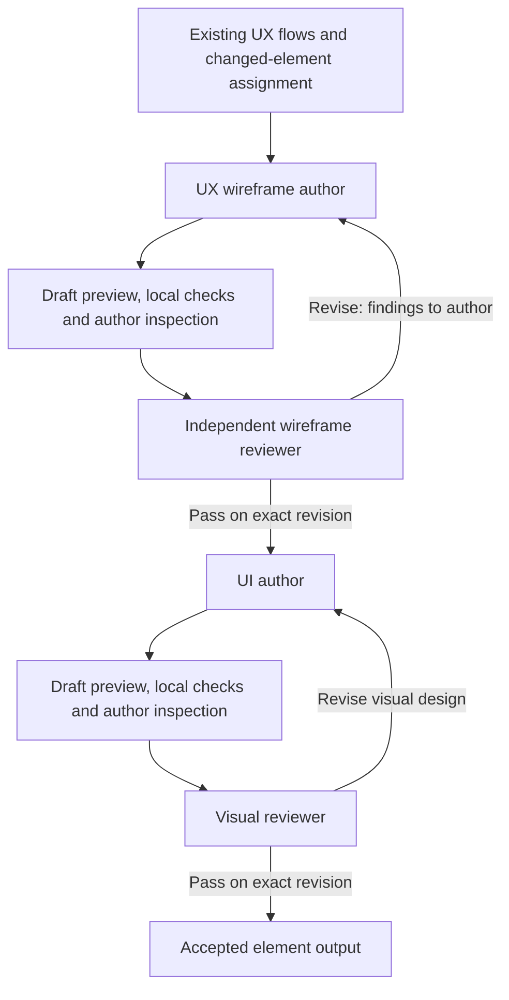

# Wireframe and UI reliability plan

Status: complete, 2026-09-30. All four changed elements passed wireframe and visual
review with the new intermediate gate. See the
[execution record](wireframe-ui-reliability-execution.md) for results, measured
recovery costs, verification and decisions.

Improve the first wireframe and UI proposals, reduce repeated authoring, and
require independent wireframe acceptance before UI work begins. Optimize time
to accepted output and credit use, including any extra checking before review.

Evidence: [pilot execution](wireframe-ui-pilot-execution.md),
[metrics](wireframe-ui-pilot-20260930-metrics.json), and the
[follow-up list](wireframe-ui-followups.md).

## Scope and baseline

Start with the timeline-add dialog, then exercise all four changed pilot elements.
Reuse the original saved Alexa UX, design foundations and research. Keep trials
isolated and reversible, with protected inputs checked before and after execution.
Do not feed corrected pilot designs or reviewer remedies to trial authors as
answers. Use those artifacts for local regression checks and outcome comparison.

The pilot's review/rework phase took 76m38s. The add dialog incurred roughly
27m11s of completed author repair. Its failures were a missing specific-item
selection path, overlapping content after that repair, and unsupported visual
state values. Some renderer and handoff defects were corrected during the pilot;
retain those fixes and distinguish them from new improvements.

The initial UX flow agent and its review remain outside this change. Its saved
output is still unreviewed. Wireframe and UI passes cannot confer upstream UX
approval. Missing or contradictory upstream behavior becomes a scoped repair
issue, with a source reference, rather than an invented product decision.

## Intended workflow

A wireframe rejection prevents UI dispatch for that element. Other independent
elements continue. Shared behavior or geometry dependencies must be stable before
dependent work is assigned. If visual review exposes a wireframe problem, route
that finding back to the wireframe author and repeat wireframe acceptance before
updating UI. Preserve accepted, unaffected work.

The experiment already has a wireframe reviewer, but initial reviews run after
the first comps. Reuse that review machinery as a mandatory intermediate stage.
Formalize a dedicated `ux-wireframe-reviewer` role when integrating the workflow.
It is distinct from the upstream UX reviewer and from code-standards reviewers.

## Stage 1: Share the behavioral and rendering contract

- Assemble a compact per-element packet mechanically from existing flow, action
  and frame references: applicable steps, outcomes, alternate flows, intermediate
  dialogs, constraints and unresolved issues. Include only relevant shared rules.
- Give author and reviewer the same packet and acceptance criteria. Preserve
  source wording and stable references; avoid a second manually maintained
  requirements list or a new dependency graph.
- As it authors controls, have the wireframe agent associate existing action/step
  references with the controls, intermediate interaction and visible outcome.
  Require a brief explanation only for an omission, ambiguity or upstream issue.
  Reference coverage is a useful check, not proof of usable behavior.
- Publish component capabilities from the renderer's actual supported templates,
  states and properties. Both authoring validation and examples use that source.

For the add dialog, the usage walk-through must cover category selection,
specific-item selection, staged identity, replacement, destination retention,
explicit Add, failure/conflict recovery and disabled selection during commit.
The author decides how to surface these existing behaviors.

Deliverable: one reusable assignment/acceptance contract and a generated packet
for the add dialog. Confirm coverage against the original saved UX before a paid
trial. Do not generate a new UX proposal to obtain the packet.

## Stage 2: Make correct construction easier

- Extend the existing layout primitives with a reusable dialog pattern: header,
  content-sized sections, optional bounded scrolling list and footer. Derive
  placement from content instead of requiring repeated manual height arithmetic.
  Allow custom component structures where the pattern does not fit.
- Validate template-specific states/properties during contribution. For example,
  return the offending node and supported values when a status uses `error` but
  its template supports `failed`. Do not silently reinterpret unknown behavior.
- Preserve valid contributions and support targeted edits to a part's structure
  or node properties, so a local repair does not resend all scenes and parts.
- Return a screenshot and rendered-layout diagnostics with a draft preview.
  Start with clipped interactive controls and unintended content/footer overflow.
  Respect declared scroll regions and overlays; ambiguous overlaps are warnings
  for author inspection, not unconditional rejection.
- Separate saved draft/preview from submission for review. The author inspects
  the supplied preview and its usage coverage once, fixes local defects, then
  submits the exact revision. Save progress throughout. Additional edits require
  another submission; rendering alone must not dispatch UI.

Deliverable: the add-dialog pattern and incremental preview/edit operations.
Verify the supported states and representative long-content/commit scenes locally.
Use the saved bad selector layout and unsupported state as focused regressions.
Mechanical diagnostics do not claim to test runtime interaction or accessibility.

## Stage 3: Put wireframe review before UI dispatch

Reviewer responsibilities:

- Evaluate changed-use-case coverage, discoverability, control hierarchy,
  intermediate dialogs, recovery, focus intent, coherent boundaries and the
  actual rendered geometry. Neutral wireframe styling is intentional.
- Return consequential findings with source, scene/node, issue and required
  outcome. Keep optional design preferences separate from blocking defects.
- Re-review earlier findings and affected changes. Expand only when a changed
  dependency provides a concrete reason; do not reopen unaffected decisions.
- Reuse the same reviewer context across coherent elements or small batches.
  Review one saved submitted revision, with its packet and screenshot, at a time.

Coordinator responsibilities:

- Dispatch UI only with a matching wireframe pass. Bind it to element ID, exact
  revision/content hash and relevant source/render-contract versions. Code owns
  these identities; agents should not reproduce bookkeeping.
- On rejection, retain the draft and findings, return targeted work to the
  wireframe author, and continue other ready elements. After acceptance, dispatch
  the latest accepted revision once.
- A newer submitted wireframe supersedes queued stale work. If accepted source
  changes while UI is active, preserve its results but mark their binding stale
  and schedule a targeted update after renewed wireframe acceptance.
- Reuse matching review receipts on resume. Never reinterpret an unresolved
  element as approved. Preserve the pilot's bounded repair policy, record the
  remaining issue and remediation, and continue independent work.

Deliverable: the intermediate review stage plus local acceptance evidence that
rejection produces zero UI dispatches, a pass releases one exact assignment,
and restart/stale-revision handling does not duplicate or bypass the review.
These are targeted tests of the requested behavior, alongside happy-path tests.

## Stage 4: Run the add-dialog acceptance trial

Use one persistent wireframe author, one wireframe reviewer, one UI author and
one visual reviewer. Keep the pilot model/effort choices to avoid mixing a model
change into this trial: wireframe Sol/medium; UI and independent reviewers
Astra/ultra. Use normal Codex execution and the existing MCP data service. Do not
use a localhost model redirect or performance observer proxy.

Start from the original inputs in a fresh isolated attempt. Run authoring,
preview inspection, wireframe review/rework, UI authoring and visual review/rework
to an accepted or explicitly unresolved result. Reuse new saved contributions
and receipts after any interruption; fix tooling errors without restarting
successful work.

Record these per-element intervals and counts:

| Measurement                                                                 | Purpose                                                        |
| --------------------------------------------------------------------------- | -------------------------------------------------------------- |
| Input preparation, input collection and boundary decisions                  | Expose added packet and assignment costs                       |
| First authoring, contribution generation and tool durations when observable | Separate model work from mechanical execution                  |
| Preview checks, author inspection and local corrections                     | Count work moved before review                                 |
| First review, author repair and recheck                                     | Identify remaining review-driven cost                          |
| Wireframe acceptance to UI dispatch; stale/redundant UI updates             | Verify that the gate prevents wasted downstream work           |
| First submitted and accepted artifact timestamps                            | Measure both first-pass speed and acceptance latency           |
| Findings by omission, layout, rendering or judgment                         | Show which causes remain                                       |
| Available model/settings and usage metadata                                 | Expose cost changes without inventing unavailable token totals |

Report total elapsed time separately from overlapping role durations. Where
intervals are nested, label the parent and subset. Do not call command generation
or unclassified time pure reasoning. Record all local correction effort even if
the first independent review passes.

Deliverable: a short report with artifacts, findings, decisions, measured phases
and unchanged-input evidence. Compare against the saved pilot as a directional
before/after; it contains different tooling and review ordering, so one run does
not establish a causal percentage speedup. Investigate substantial regressions
before expanding. A single pass is promising evidence, not a pass-rate estimate.

## Stage 5: Confirm across the complete changed set

Apply the same workflow to clip-update dialog, selection menu, add dialog and
timeline. Preserve unchanged-element reuse and per-element metrics. Reuse the
accepted add-dialog trial only if all bound inputs/contracts still match; label
that evidence reused, and do not include it as fresh authoring in total timings.
If timing a wholly fresh full set, report that as a separate run.

Keep one author per role for this comparison. Do not add worker pools, prewarming
changes or a new data format at the same time. Let reviewers advance to other
independent submitted elements while authors repair rejected ones where ownership
permits; preserve required per-element ordering.

Deliverable: four-element quality and acceptance-cost report. Require complete
usage coverage or explicit unresolved source issues, no consequential open
findings on accepted artifacts, and zero UI dispatches from rejected/stale
wireframes. Continue tuning if added checking outweighs avoided repairs.

## Stage 6: Integrate the demonstrated workflow

Promote the accepted operations and handoff rules into the normal refine-design
MCP path and orchestration instructions. Add the dedicated wireframe author and
`ux-wireframe-reviewer` source definitions where absent, update UI ownership to
consume accepted wireframes, and update `governance.json` with any managed agent
additions in the same change. Update installer/catalog checks and workflow docs.
The visual reviewer remains responsible for designed comps.

Run focused package and integration checks for the changed contracts. Keep the
upstream UX review status distinct. Preserve experimental evidence; do not add
permanent compatibility code for disposable pilot data. Repository integration
does not silently install or change global agent settings.

Deliverable: one consistent author/reviewer contract and the same review-before-UI
rule in both experiments and ordinary refinement. Produce a summary of changes,
verification, performance evidence, decisions and remaining limitations.

## Execution discipline and checkpoints

Build and verify each coherent stage before expanding. Run code reviewers
sparingly on substantial changes; the per-element product reviews above are part
of the behavior being tested. Concentrate development tests on working paths and
the specific observed failures/handoff invariants. Broader negative and platform
coverage can follow after those paths work.

When execution is requested, use the checkpoint adviser for meaningful units,
with the user's existing preapproval of suggested local commit messages. Suggested
units are authoring/preview contracts, intermediate review dispatch, and measured
integration. Retain progress and decision notes; resolve routine questions with
best judgment and avoid repeating completed model work.
